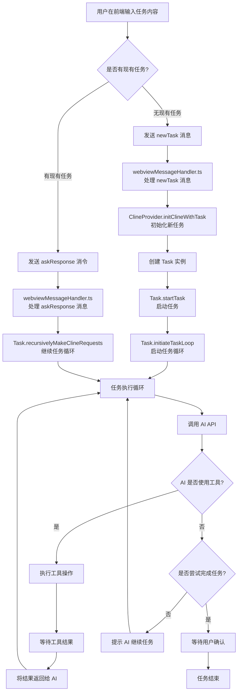
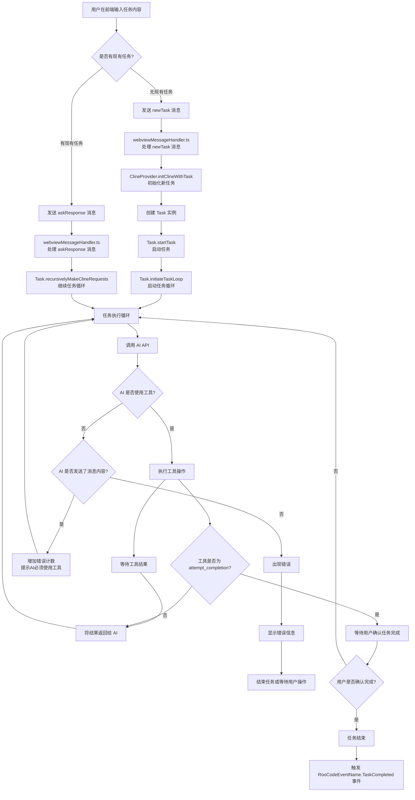
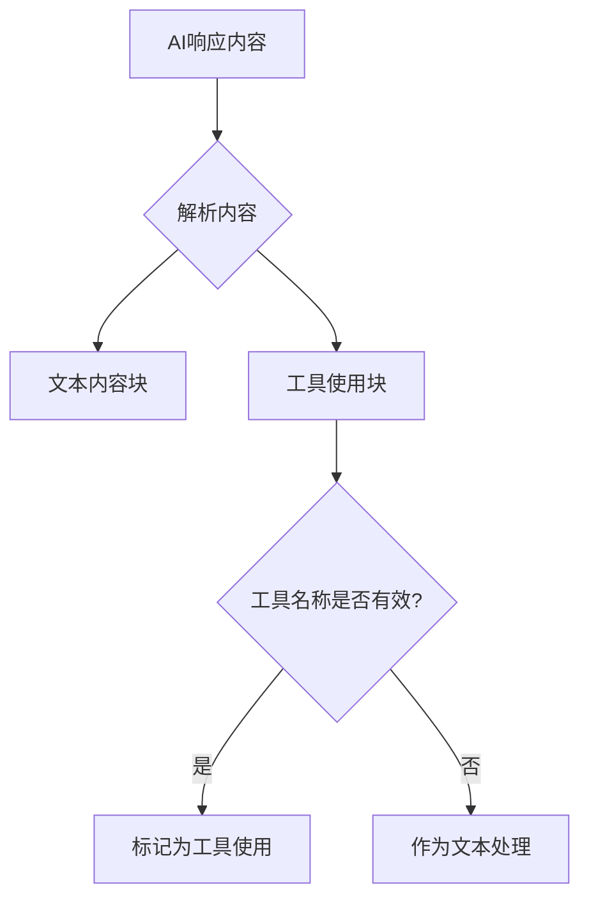
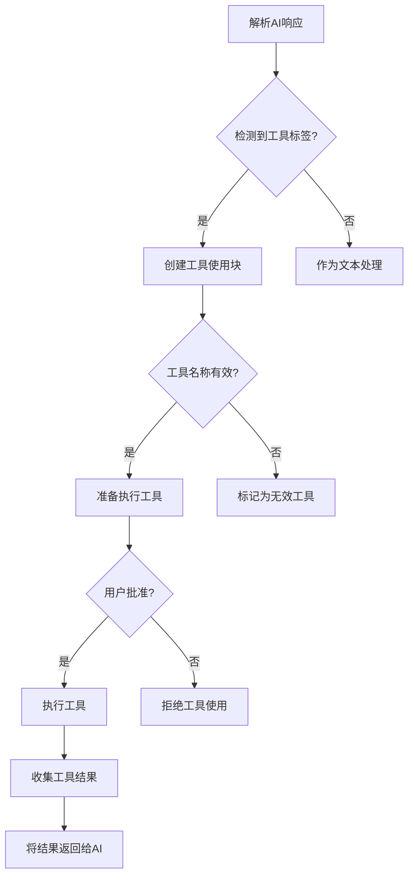
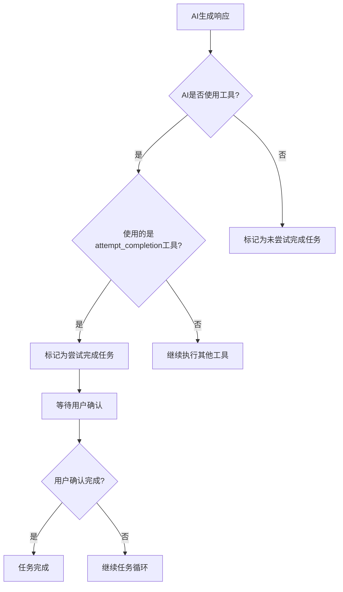

了解了 [initiateTaskLoop](file:///c:/Users/phx10/code/Roo-Code-J-3.28.2/src/core/taskManager.ts#L49-L156) 方法的触发流程和中间流程，让我为您创建一个流程图来展示这个过程。





这个流程图展示了 [initiateTaskLoop](file:///c:/Users/phx10/code/Roo-Code-J-3.28.2/src/core/taskManager.ts#L49-L156) 方法的完整触发和执行过程：

1. **用户触发**：用户在前端聊天界面输入任务内容并发送
2. **消息路由**：根据是否有现有任务，发送 [newTask](file:///c:/Users/phx10/code/Roo-Code-J-3.28.2/src/core/webview/ClineProvider.ts#L607-L607) 或 [askResponse](file:///c:/Users/phx10/code/Roo-Code-J-3.28.2/src/core/webview/ClineProvider.ts#L577) 消息
3. **后端处理**：[webviewMessageHandler.ts](file:///c:/Users/phx10/code/Roo-Code-J-3.28.2/src/core/webview/webviewMessageHandler.ts) 处理消息并初始化任务
4. **任务初始化**：通过 [ClineProvider.initClineWithTask](file:///c:/Users/phx10/code/Roo-Code-J-3.28.2/src/core/webview/ClineProvider.ts#L607) 创建 [Task](file:///c:/Users/phx10/code/Roo-Code-J-3.28.2/src/core/task/Task.ts#L152-L2182) 实例并启动
5. **任务循环**：[initiateTaskLoop](file:///c:/Users/phx10/code/Roo-Code-J-3.28.2/src/core/taskManager.ts#L49-L156) 开始执行，进入 AI 交互循环
6. **AI 交互**：循环中调用 AI API，处理工具使用和结果反馈
7. **循环控制**：根据 AI 的响应决定继续循环或结束任务

这个设计实现了 Roo Code 的核心功能 - 一个自主的 AI 编程代理，能够持续与用户交互并执行编程任务，直到任务完成并得到用户确认。

## AI工具使用判断机制

在Roo Code中，判断AI是否使用工具的机制主要分为以下几个步骤：

### 1. 解析AI响应内容

AI响应会被解析成内容块（content blocks），主要有两种类型：

- 文本内容（text content）
- 工具使用（tool use）



### 2. 工具使用检测逻辑

系统通过以下方式判断AI是否使用工具：

1. **标签检测**：解析AI响应中的XML标签，如`<write_to_file>`、`<read_file>`等
2. **工具名称验证**：检查标签是否为有效的工具名称
3. **参数解析**：提取工具所需的参数

### 3. 工具执行判断流程



### 4. 核心判断点

1. **解析阶段**：[parseAssistantMessage](file:///c:/Users/phx10/code/Roo-Code-J-3.28.2/src/core/assistant-message/parseAssistantMessage.ts#L7-L164)函数负责识别和解析工具使用标签
2. **验证阶段**：[validateToolUse](file:///c:/Users/phx10/code/Roo-Code-J-3.28.2/src/core/tools/validateToolUse.ts#L25-L152)函数验证工具名称和参数是否有效
3. **执行阶段**：[presentAssistantMessage](file:///c:/Users/phx10/code/Roo-Code-J-3.28.2/src/core/assistant-message/presentAssistantMessage.ts#L36-L597)函数处理工具执行逻辑

### 5. 工具使用的关键代码逻辑

在[presentAssistantMessage.ts](file:///c:/Users/phx10/code/Roo-Code-J-3.28.2/src/core/assistant-message/presentAssistantMessage.ts)中，系统通过以下方式处理工具使用：

```typescript
// 当检测到工具使用块时
switch (block.name) {
    case "write_to_file":
        // 执行写文件工具
        await writeToFileTool(...)
        break
    case "read_file":
        // 执行读文件工具
        await readFileTool(...)
        break
    // ... 其他工具
}
```

### 6. 工具使用状态跟踪

系统通过以下变量跟踪工具使用状态：

- [didRejectTool](file://c:\Users\phx10\code\Roo-Code-J-3.28.2\src\core\task\Task.ts#L249-L249)：用户是否拒绝了工具使用
- [didAlreadyUseTool](file://c:\Users\phx10\code\Roo-Code-J-3.28.2\src\core\task\Task.ts#L250-L250)：是否已经执行了一个工具
- [userMessageContentReady](file://c:\Users\phx10\code\Roo-Code-J-3.28.2\src\core\task\Task.ts#L248-L248)：用户消息内容是否准备就绪

总的来说，系统通过解析AI响应中的XML标签来判断是否使用工具，并通过验证和用户批准流程来决定是否实际执行工具。

## "是否尝试完成任务"的判断机制

在 Roo Code 系统中，"是否尝试完成任务"的判断主要由 AI 自主决定，系统通过检测 AI 是否调用 [attempt_completion](file:///c:\Users\phx10\code\Roo-Code-J-3.28.2\src\core\tools\attemptCompletionTool.ts#L14-L140) 工具来判断。

### 判断流程



### 参与者角色

1. **AI 角色**：主要判断者，通过决定是否调用 [attempt_completion](file:///c:\Users\phx10\code\Roo-Code-J-3.28.2\src\core\tools\attemptCompletionTool.ts#L14-L140) 工具来表达任务完成的意图
2. **系统代码**：检测和处理 [attempt_completion](file:///c:\Users\phx10\code\Roo-Code-J-3.28.2\src\core\tools\attemptCompletionTool.ts#L14-L140) 工具调用
3. **用户**：最终确认者，决定是否接受 AI 的完成声明

### 判断逻辑详解

1. **AI 工具使用检测**：

    - 在 [recursivelyMakeClineRequests](file:///c:\Users\phx10\code\Roo-Code-J-3.28.2\src\core\task\Task.ts#L1352-L1809) 方法中，系统检查 AI 响应是否包含工具使用：

    ```typescript
    const didToolUse = this.assistantMessageContent.some((block) => block.type === "tool_use")
    ```

2. **特定工具识别**：

    - 当 AI 使用工具时，系统通过 [presentAssistantMessage](file:///c:\Users\phx10\code\Roo-Code-J-3.28.2\src\core\assistant-message\presentAssistantMessage.ts#L36-L597) 函数处理各种工具，其中包括 [attempt_completion](file:///c:\Users\phx10\code\Roo-Code-J-3.28.2\src\core\tools\attemptCompletionTool.ts#L14-L140) 工具

3. **完成状态处理**：

    - 当 AI 调用 [attempt_completion](file:///c:\Users\phx10\code\Roo-Code-J-3.28.2\src\core\tools\attemptCompletionTool.ts#L14-L140) 工具时，系统会：
        - 显示完成结果给用户
        - 等待用户确认
        - 根据用户反馈决定是否真正结束任务

4. **未使用工具的情况**：
    - 如果 AI 没有使用任何工具，系统会认为任务未完成，并增加错误计数：
    ```typescript
    if (!didToolUse) {
    	this.userMessageContent.push({ type: "text", text: formatResponse.noToolsUsed() })
    	this.consecutiveMistakeCount++
    }
    ```

### 总结

判断"是否尝试完成任务"主要是由 AI 通过调用 [attempt_completion](file:///c:\Users\phx10\code\Roo-Code-J-3.28.2\src\core\tools\attemptCompletionTool.ts#L14-L140) 工具来表达的，系统代码负责检测这个调用并处理后续的用户确认流程。这是一个由 AI 发起、由系统检测、由用户确认的三方协作过程。
