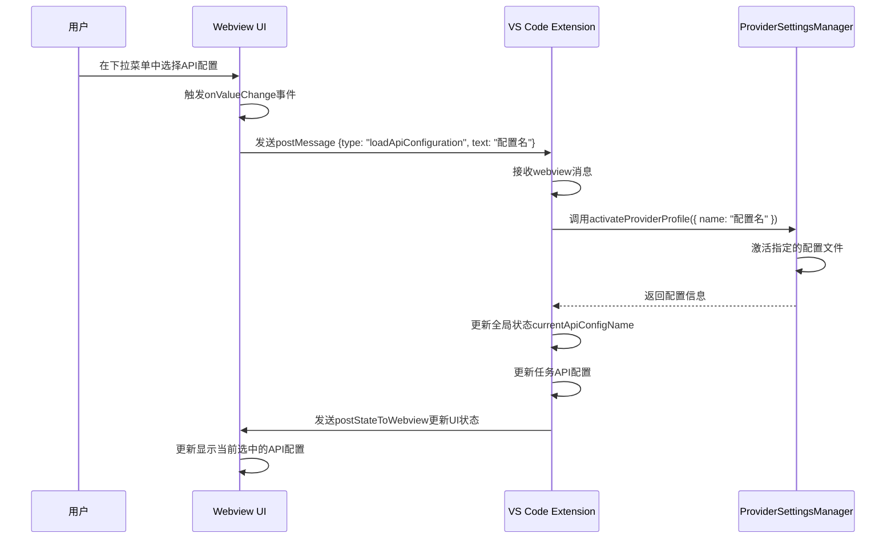

分析在 Roo Code 项目中触发 'loadApiConfiguration' 事件的组件和动作。首先，需要搜索相关代码来找出这个事件的触发位置和处理逻辑。

## 触发 loadApiConfiguration 事件的组件和动作

从代码搜索结果可以看出，`loadApiConfiguration` 事件主要在以下两个组件中被触发：

### 1. ModesView 组件

在 [webview-ui\src\components\modes\ModesView.tsx](file:///c%3A/Users/phx10/code/Roo-Code-J-3.28.2/webview-ui/src/components/modes/ModesView.tsx) 文件中，当用户在 API 配置下拉选择器中选择一个配置时会触发：

```typescript
<Select
  value={currentApiConfigName}
  onValueChange={(value) => {
    vscode.postMessage({
      type: "loadApiConfiguration",
      text: value,
    })
  }}>
  <SelectTrigger className="w-full">
    <SelectValue placeholder={t("settings:common.select")} />
  </SelectTrigger>
  <SelectContent>
    {(listApiConfigMeta || []).map((config) => (
      <SelectItem key={config.id} value={config.name}>
        {config.name}
      </SelectItem>
    ))}
  </SelectContent>
</Select>
```

### 2. SettingsView 组件

在 [webview-ui\src\components\settings\SettingsView.tsx](file:///c%3A/Users/phx10/code/Roo-Code-J-3.28.2/webview-ui/src/components/settings/SettingsView.tsx) 文件中，当用户在 API 配置管理器中选择一个配置时会触发：

```typescript
<ApiConfigManager
  currentApiConfigName={currentApiConfigName}
  listApiConfigMeta={listApiConfigMeta}
  onSelectConfig={(configName: string) =>
    checkUnsaveChanges(() =>
      vscode.postMessage({ type: "loadApiConfiguration", text: configName }),
    )
  }
  // ... 其他属性
/>
```

## 时序图

下面是用户触发 `loadApiConfiguration` 事件的时序图：



## 事件处理流程

1. 用户在 UI 中选择一个新的 API 配置
2. [ModesView.tsx](file:///c%3A/Users/phx10/code/Roo-Code-J-3.28.2/webview-ui/src/components/modes/ModesView.tsx) 或 [SettingsView.tsx](file:///c%3A/Users/phx10/code/Roo-Code-J-3.28.2/webview-ui/src/components/settings/SettingsView.tsx) 组件捕获选择事件
3. 通过 `vscode.postMessage` 发送 `loadApiConfiguration` 消息到 VS Code 扩展
4. VS Code 扩展在 [webviewMessageHandler.ts](file:///c%3A/Users/phx10/code/Roo-Code-J-3.28.2/src/core/webview/webviewMessageHandler.ts) 中处理该消息
5. 调用 [ProviderSettingsManager](file:///c%3A/Users/phx10/code/Roo-Code-J-3.28.2/src/core/config/ProviderSettingsManager.ts#L31-L572) 激活选定的配置文件
6. 更新全局状态和当前任务的 API 配置
7. 将更新后的状态发送回 Webview UI 进行显示更新

这个流程确保了当用户选择不同的 API 配置时，系统能够正确加载并应用相应的配置参数。
