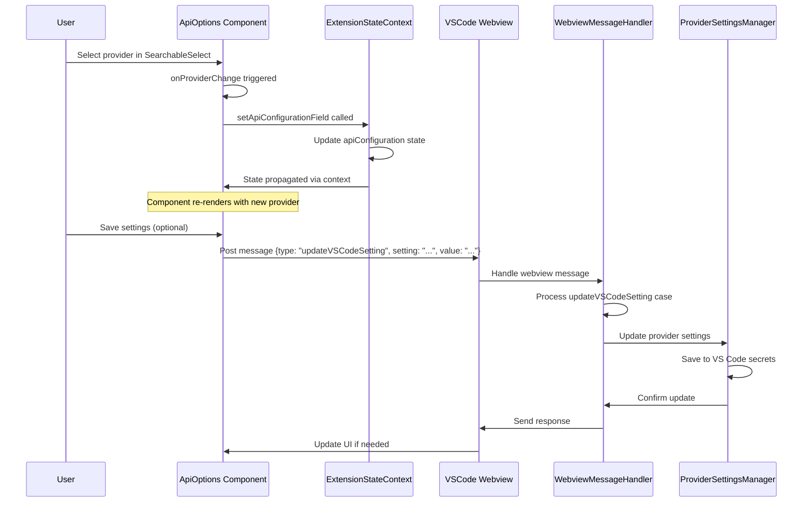

分析用户在ApiOptions.tsx组件中选择模型提供商后，组件属性更新以及消息传递到webviewMessageHandler的过程。首先让我找到相关的文件和代码。

当用户在ApiOptions.tsx组件中选择模型提供商时，会发生以下一系列更新和通信过程：

### 1. 前端组件状态更新

在[ApiOptions.tsx](file:///c:/Users/phx10/code/Roo-Code-J-3.28.2/webview-ui/src/components/settings/ApiOptions.tsx)组件中，当用户从[SearchableSelect](file:///c:/Users/phx10/code/Roo-Code-J-3.28.2/webview-ui/src/components/ui/select.tsx#L135-L135)选择一个提供商时：

1. [onProviderChange](file:///c:/Users/phx10/code/Roo-Code-J-3.28.2/webview-ui/src/components/settings/ApiOptions.tsx#L280-L351)回调函数被调用，传入选中的提供商名称
2. 该函数调用[setApiConfigurationField](file:///c:/Users/phx10/code/Roo-Code-J-3.28.2/webview-ui/src/components/settings/ApiOptions.tsx#L104-L104)更新[apiProvider](file:///c:/Users/phx10/code/Roo-Code-J-3.28.2/packages/types/src/api/ProviderSettings.ts#L135-L135)字段
3. 根据选中的提供商，还会设置相应的默认模型ID（如[openRouterModelId](file:///c:/Users/phx10/code/Roo-Code-J-3.28.2/packages/types/src/api/ProviderSettings.ts#L144-L144)、[glamaModelId](file:///c:/Users/phx10/code/Roo-Code-J-3.28.2/packages/types/src/api/ProviderSettings.ts#L145-L145)等）

### 2. 状态在组件树中的传播

[setApiConfigurationField](file:///c:/Users/phx10/code/Roo-Code-J-3.28.2/webview-ui/src/components/settings/ApiOptions.tsx#L104-L104)函数通常来自[ExtensionStateContext](file:///c:/Users/phx10/code/Roo-Code-J-3.28.2/webview-ui/src/context/ExtensionStateContext.tsx#L151-L151)，它会更新整个应用的状态：

1. 状态通过[ExtensionStateContext](file:///c:/Users/phx10/code/Roo-Code-J-3.28.2/webview-ui/src/context/ExtensionStateContext.tsx#L151-L151)传播到所有使用该上下文的组件
2. [setApiConfiguration](file:///c:/Users/phx10/code/Roo-Code-J-3.28.2/webview-ui/src/context/ExtensionStateContext.tsx#L234-L243)函数更新[apiConfiguration](file:///c:/Users/phx10/code/Roo-Code-J-3.28.2/packages/types/src/ExtensionState.ts#L75-L75)状态

### 3. 从前端到后端的通信

当状态发生变化时，会通过`vscode.postMessage`机制将更新发送到插件后端：

1. 在[webviewMessageHandler.ts](file:///c:/Users/phx10/code/Roo-Code-J-3.28.2/src/core/webview/webviewMessageHandler.ts#L58-L2607)中，有一个专门处理[updateVSCodeSetting](file:///c:/Users/phx10/code/Roo-Code-J-3.28.2/src/core/webview/webviewMessageHandler.ts#L1558-L1567)消息的case
2. 当前端发送`{type: "updateVSCodeSetting", setting: "...", value: "..."}`消息时，会被这个case处理
3. 代码会检查该设置是否在[ALLOWED_VSCODE_SETTINGS](file:///c:/Users/phx10/code/Roo-Code-J-3.28.2/src/core/webview/webviewMessageHandler.ts#L4-L4)集合中，如果允许则更新工作区配置

### 4. 具体更新流程

1. 用户在[ApiOptions.tsx](file:///c:/Users/phx10/code/Roo-Code-J-3.28.2/webview-ui/src/components/settings/ApiOptions.tsx)中选择提供商
2. [onProviderChange](file:///c:/Users/phx10/code/Roo-Code-J-3.28.2/webview-ui/src/components/settings/ApiOptions.tsx#L280-L351)调用[setApiConfigurationField](file:///c:/Users/phx10/code/Roo-Code-J-3.28.2/webview-ui/src/components/settings/ApiOptions.tsx#L104-L104)更新提供商设置
3. 如果需要，还会更新相关模型字段（如[openRouterModelId](file:///c:/Users/phx10/code/Roo-Code-J-3.28.2/packages/types/src/api/ProviderSettings.ts#L144-L144)等）
4. 状态更新通过[ExtensionStateContext](file:///c:/Users/phx10/code/Roo-Code-J-3.28.2/webview-ui/src/context/ExtensionStateContext.tsx#L151-L151)传播到整个应用
5. 当用户保存设置时，会发送`updateVSCodeSetting`消息到后端
6. 后端[webviewMessageHandler.ts](file:///c:/Users/phx10/code/Roo-Code-J-3.28.2/src/core/webview/webviewMessageHandler.ts#L58-L2607)接收并处理该消息，更新VS Code设置

整个流程确保了用户界面的响应性和状态的一致性，同时通过消息传递机制实现了前后端的解耦。
